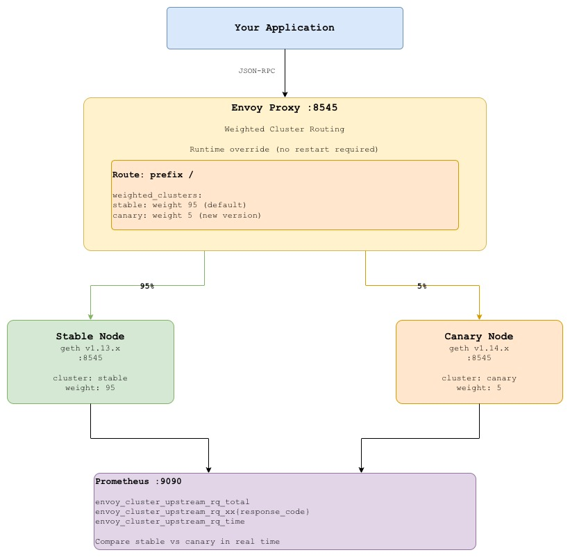
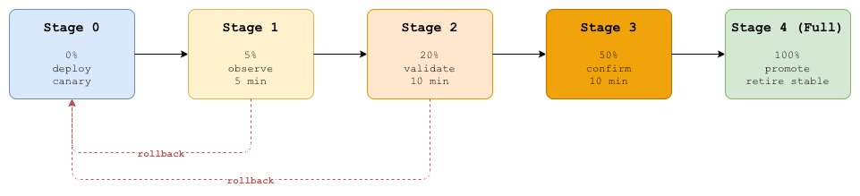
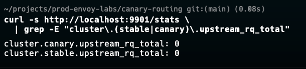
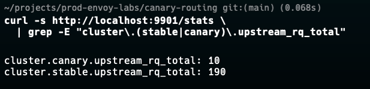
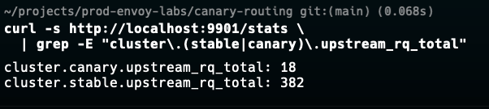
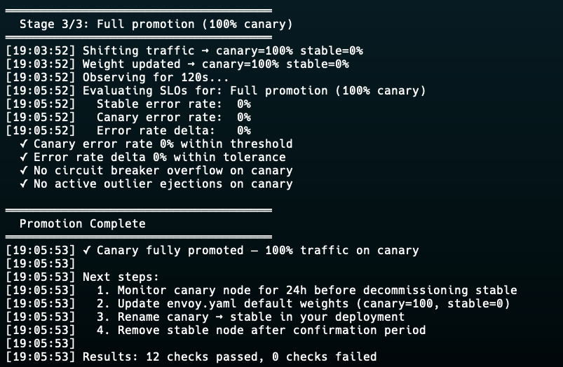

# Lab 06: Canary Routing for Blockchain Node Upgrades

## Overview

Upgrading an Ethereum node is one of the riskiest operations in blockchain
infrastructure. A new client version may behave differently under load, return
subtly different RPC responses, or have regressions that only surface with
real production traffic patterns. Rolling it out to 100% immediately is a
gamble that can take down your entire RPC service.

**Canary routing** solves this by splitting traffic between the current stable
version and the new candidate version at the proxy layer no changes to your
application, no DNS changes, no downtime. You start by sending 5% of traffic to
the new node, observe its behaviour, and progressively increase the weight as
confidence grows. If anything looks wrong, you shift 100% back to stable in
seconds.

This lab demonstrates a complete canary promotion workflow using Envoy weighted
clusters, with Prometheus metrics and automated promotion/rollback scripts that
reflect real production practices.

What you will learn:
- How to implement weighted traffic splitting at the proxy layer
- How to use Envoy runtime overrides to change weights without redeployment
- How to define SLOs and automate promotion/rollback decisions based on them
- How to compare error rate and latency between stable and canary in real time
- Why canary routing is safer than blue green for stateful blockchain nodes

## Architecture


## Canary Promotion Stages



**Promotion criteria (automated check at each stage):**
- Error rate on canary ≤ error rate on stable + 0.1%
- p99 latency on canary ≤ p99 latency on stable × 1.2 (20% regression tolerance)
- No circuit breaker overflow events on canary cluster

**Automatic rollback triggers:**
- Error rate on canary > 1% absolute
- p99 latency on canary > 2× stable p99
- Any `consecutive_5xx` outlier ejection on canary


## Prerequisites

| Tool | Version | Install |
|------|---------|---------|
| Docker | >= 20.x | [docs.docker.com](https://docs.docker.com/get-docker/) |
| Docker Compose | >= 2.x | Included with Docker Desktop |
| curl | any | pre-installed |
| jq | any | `brew install jq` / `apt install jq` |
| hey | any | `brew install hey` |
| bc | any | `brew install bc` / `apt install bc` |


## Quick Start

```bash
git clone https://github.com/calvin-puram/envoy-web3-rpc-labs.git
cd envoy-web3-rpc-labs/canary-routing

docker compose up -d
docker compose ps
```

Verify traffic split is active:
```bash
curl -s http://localhost:9901/stats \
  | grep -E "cluster\.(stable|canary)\.upstream_rq_total"
```


## Experiments

### Experiment 1: Verify Initial Traffic Split (95/5)

Generate traffic and confirm only ~5% reaches the canary:

```bash
# Send 200 requests
hey -n 200 -c 10 \
  -m POST \
  -H "Content-Type: application/json" \
  -d '{"jsonrpc":"2.0","method":"eth_blockNumber","params":[],"id":1}' \
  http://localhost:8545

# Check request distribution
curl -s http://localhost:9901/stats \
  | grep -E "cluster\.(stable|canary)\.upstream_rq_total"

# Expected: ~190 to stable, ~10 to canary (95/5 split)
```


### Experiment 2: Shift Traffic to 20% Canary (Runtime Override)

Increase canary traffic without restarting Envoy or changing config files:

```bash
# Shift to 20% canary using Envoy runtime layer
curl -s -X POST http://localhost:9901/runtime_modify \
  --data "routing.traffic_shift.canary=20"

# Verify the override took effect
curl -s http://localhost:9901/runtime | jq '.entries'

# Generate traffic to observe new split
hey -n 200 -c 10 \
  -m POST \
  -H "Content-Type: application/json" \
  -d '{"jsonrpc":"2.0","method":"eth_blockNumber","params":[],"id":1}' \
  http://localhost:8545

curl -s http://localhost:9901/stats \
  | grep -E "cluster\.(stable|canary)\.upstream_rq_total"

```

### Experiment 3: Compare Error Rates Between Clusters

```bash
# Error rate on stable cluster
STABLE_TOTAL=$(curl -s http://localhost:9901/stats \
  | grep "^cluster.stable.upstream_rq_total:" \
  | awk -F': ' '{print $2}' \
  | tr -d ' ')

STABLE_5XX=$(curl -s http://localhost:9901/stats \
  | grep "^cluster.stable.upstream_rq_5xx:" \
  | awk -F': ' '{print $2}' \
  | tr -d ' ')

if [ "${STABLE_TOTAL:-0}" -gt 0 ]; then
  echo "Stable error rate: $(echo "scale=4; ${STABLE_5XX:-0} / $STABLE_TOTAL * 100" | bc)%"
else
  echo "Stable error rate: N/A (no requests yet)"
fi
# Error rate on canary cluster
CANARY_TOTAL=$(curl -s http://localhost:9901/stats \
  | grep "^cluster.canary.upstream_rq_total:" \
  | awk -F': ' '{print $2}' \
  | tr -d ' ')

CANARY_5XX=$(curl -s http://localhost:9901/stats \
  | grep "^cluster.canary.upstream_rq_5xx:" \
  | awk -F': ' '{print $2}' \
  | tr -d ' ')

if [ "${CANARY_TOTAL:-0}" -gt 0 ]; then
  echo "Canary error rate: $(echo "scale=4; ${CANARY_5XX:-0} / $CANARY_TOTAL * 100" | bc)%"
else
  echo "Canary error rate: N/A (no requests yet send traffic first)"
fi
```

### Experiment 4: Automated Canary Promotion

Use the promotion script to step through stages automatically:

```bash
# Dry run shows what would happen without changing weights
bash scripts/promote.sh --dry-run

# Live promotion steps through 5% => 20% => 50% => 100%
bash scripts/promote.sh

```



### Experiment 5: Trigger Automatic Rollback

Simulate the canary node returning errors to trigger automatic rollback:

```bash
# Terminal 1 run promotion script
bash scripts/promote.sh &

# Terminal 2 after promotion reaches 20%, stop the canary node
sleep 30 && docker compose stop canary

```


### Experiment 6: Manual Rollback

If automated scripts are not available, roll back manually in under 10 seconds:

```bash
# Immediate rollback shift all traffic to stable
curl -s -X POST http://localhost:9901/runtime_modify \
  --data "routing.traffic_shift.canary=0"

# Verify
curl -s http://localhost:9901/runtime | jq '.entries["routing.traffic_shift.canary"]'
# Should return: "0"

# Confirm all traffic on stable
curl -s http://localhost:9901/stats \
  | grep -E "cluster\.(stable|canary)\.upstream_rq_total"
```

### Experiment 7: Full Promotion (100% Canary)

Once satisfied with canary behaviour, complete the promotion:

```bash
# Shift 100% to canary
curl -s -X POST http://localhost:9901/runtime_modify \
  --data "routing.traffic_shift.canary=100"

# Verify
hey -n 100 -c 10 \
  -m POST \
  -H "Content-Type: application/json" \
  -d '{"jsonrpc":"2.0","method":"eth_blockNumber","params":[],"id":1}' \
  http://localhost:8545

curl -s http://localhost:9901/stats \
  | grep -E "cluster\.(stable|canary)\.upstream_rq_total"
# Expected: ~0 stable, ~100 canary

# At this point: decommission stable, rename canary to stable
# and redeploy with updated config
```

## Prometheus Metrics

Open: **http://localhost:9090**

Useful queries for canary analysis:

```promql
# Request rate per cluster (stable vs canary)
rate(envoy_cluster_upstream_rq_total{envoy_cluster_name=~"stable|canary"}[1m])

# Error rate per cluster
rate(envoy_cluster_upstream_rq_xx{response_code_class="5xx",
  envoy_cluster_name=~"stable|canary"}[1m])
/ rate(envoy_cluster_upstream_rq_total{
  envoy_cluster_name=~"stable|canary"}[1m])

# p99 latency per cluster (requires histogram)
histogram_quantile(0.99,
  rate(envoy_cluster_upstream_rq_time_bucket{
    envoy_cluster_name=~"stable|canary"}[5m]))

# Traffic split percentage
rate(envoy_cluster_upstream_rq_total{envoy_cluster_name="canary"}[1m])
/ rate(envoy_cluster_upstream_rq_total{
    envoy_cluster_name=~"stable|canary"}[1m]) * 100
```

## Envoy Admin Dashboard

Open: **http://localhost:9901**

| Endpoint | What to Look For |
|----------|-----------------|
| `/stats` | `cluster.stable.*` vs `cluster.canary.*` request counts |
| `/clusters` | Both clusters healthy, weight distribution |
| `/runtime` | Active traffic split override value |
| `/config_dump` | Weighted cluster config as loaded |

---

## Key Envoy Concepts Used

### Weighted Clusters
```yaml
weighted_clusters:
  clusters:
    - name: stable
      weight: 95
    - name: canary
      weight: 5
  total_weight: 100
```
Envoy distributes requests proportionally. Weights are relative total
does not need to equal 100 but keeping it at 100 makes percentages intuitive.

### Runtime Override for Zero-Downtime Weight Changes
```yaml
weight_runtime_key: "routing.traffic_shift.canary"
```
Envoy watches a runtime key for each cluster weight. When you POST to
`/runtime_modify`, the new weight takes effect immediately no config reload,
no restart, no dropped connections.

### Separate Clusters per Deployment
```yaml
clusters:
  - name: stable   # geth v1.13.x
  - name: canary   # geth v1.14.x
```
Separate clusters give separate stats per version you cannot compare
error rates between versions if they share a cluster.

### Per-Cluster Circuit Breakers
```yaml
# Canary gets stricter thresholds  limits blast radius
circuit_breakers:
  thresholds:
    - max_connections: 20       # vs 100 on stable
      max_pending_requests: 10  # vs 50 on stable
```
If the canary node misbehaves, it cannot consume more than 20% of connection
capacity — stable continues serving the majority of traffic unaffected.


## Canary vs Blue-Green for Blockchain Nodes

| | Canary | Blue-Green |
|---|---|---|
| Traffic shift | Gradual (5% => 100%) | Instant (0% => 100%) |
| Rollback time | Seconds (runtime override) | Seconds (DNS/LB switch) |
| Blast radius | Small (only canary %) | Full (all traffic) |
| Observability | Compare stable vs canary | Before vs after |
| Node state sync | Both nodes sync continuously | Green syncs before cutover |
| Suitable for | Version upgrades, config changes | Major version migrations |

For blockchain nodes specifically, canary is preferred because:
- Nodes can fall behind on sync during restart gradual rollout buys time
- RPC response differences between versions surface with real traffic
- Rollback is instant without re-syncing a node from scratch


## Cleanup

```bash
docker compose down -v
```


## What's Next

- **[Fault Injection](../fault-injection/)**  test canary resilience by injecting errors and latency


## References

- [Envoy Weighted Cluster Routing](https://www.envoyproxy.io/docs/envoy/latest/configuration/http/http_conn_man/traffic_splitting)
- [Envoy Runtime Configuration](https://www.envoyproxy.io/docs/envoy/latest/configuration/operations/runtime)
- [Google SRE Canarying Releases](https://sre.google/workbook/canarying-releases/)
- [Envoy Traffic Shifting](https://www.envoyproxy.io/docs/envoy/latest/configuration/http/http_conn_man/traffic_splitting#traffic-shifting)