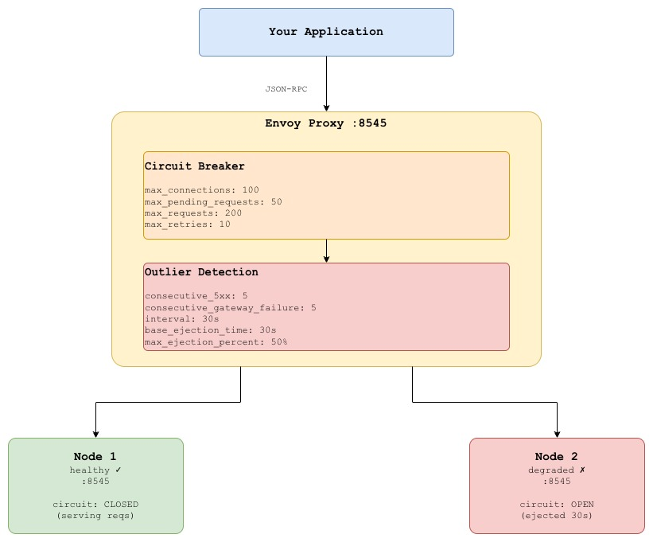
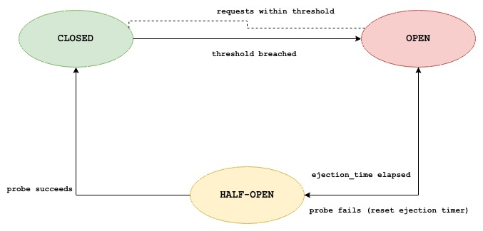
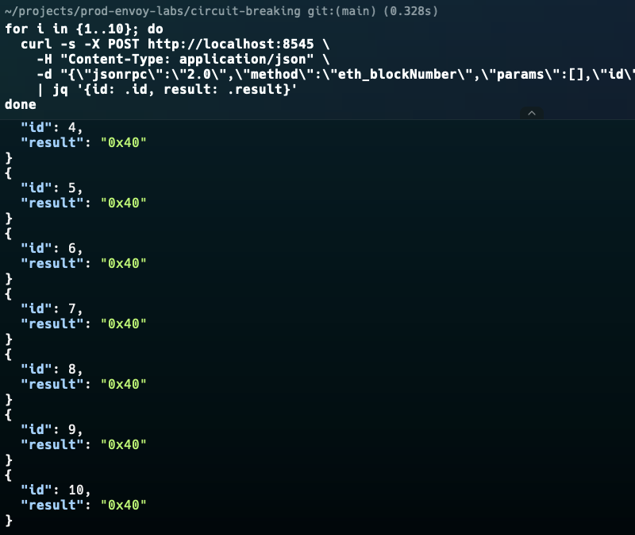
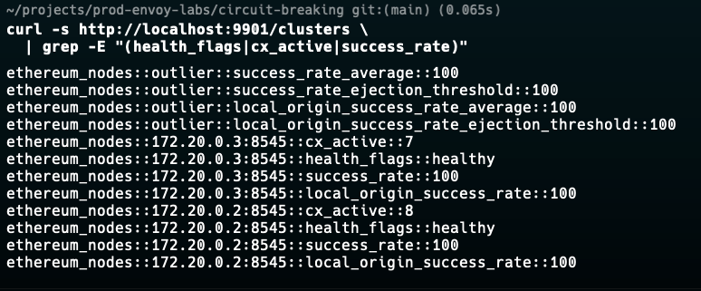
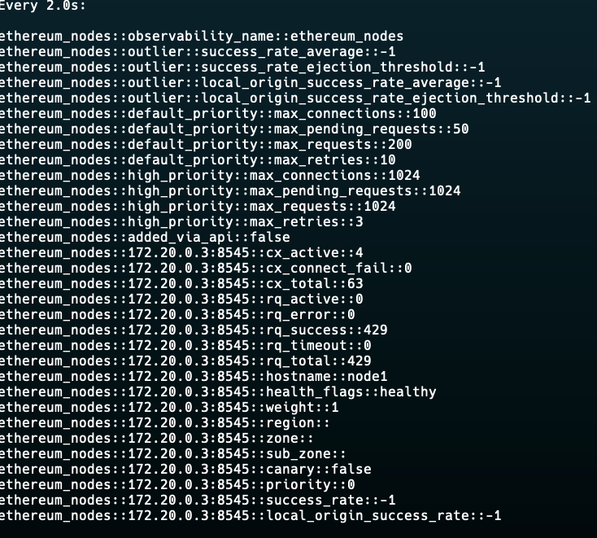
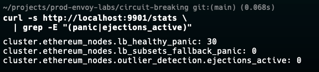

# Lab 05: Circuit Breaking for Ethereum RPC Nodes

## Overview

Without circuit breaking, a degraded upstream node creates a compounding failure:
requests queue up, threads exhaust, timeouts cascade, and eventually the entire
system is unavailable.

The circuit breaker pattern solves this by **failing fast**. Instead of waiting
for a slow node to eventually timeout, Envoy tracks failure rates and connection
pool exhaustion in real time. When thresholds are breached, the circuit opens
requests to that upstream are rejected immediately with a `503` rather than
hanging for 30 seconds. This protects the application and gives the upstream
node time to recover without being bombarded by traffic it cannot handle.

Envoy implements two complementary mechanisms:

- **Circuit breakers**  static thresholds on connections, requests, retries
- **Outlier detection**  dynamic ejection of nodes based on observed error rates

This lab demonstrates both, applied to a realistic blockchain RPC scenario where
one node becomes degraded and the proxy must route around it automatically.

What you will learn:
- The difference between circuit breakers (proactive) and outlier detection (reactive)
- How to tune thresholds for RPC workloads specifically
- How to observe circuit state changes in real time via Envoy stats
- How to simulate node degradation and verify automatic recovery
- Why `max_pending_requests` is the most important threshold for RPC proxies


## Architecture




## Circuit Breaker States


| State | Behaviour | Envoy Equivalent |
|-------|-----------|-----------------|
| CLOSED | Normal  requests flow through | `cx_open = 0` |
| OPEN | Failing fast  immediate 503 | `cx_open = 1`, host ejected |
| HALF-OPEN | Probe request allowed through | Host back in rotation, being tested |


## Circuit Breaker vs Outlier Detection

| | Circuit Breaker | Outlier Detection |
|---|---|---|
| Type | Proactive  static thresholds | Reactive  observed error rates |
| Triggers on | Connection/request count limits | 5xx errors, connection failures, latency |
| Scope | Entire cluster | Per individual upstream host |
| Recovery | Immediate when load drops | After `base_ejection_time` |
| Use case | Protect against overload | Eject consistently failing nodes |

**Use both together**  circuit breakers protect against volume spikes,
outlier detection removes bad nodes from the pool.


## Prerequisites

| Tool | Version | Install |
|------|---------|---------|
| Docker | >= 20.x | [docs.docker.com](https://docs.docker.com/get-docker/) |
| Docker Compose | >= 2.x | Included with Docker Desktop |
| curl | any | pre-installed |
| jq | any | `brew install jq` / `apt install jq` |
| hey | any | `brew install hey` (load testing) |


## Quick Start

```bash
git clone https://github.com/calvin-puram/envoy-web3-rpc-labs.git
cd envoy-web3-rpc-labs/circuit-breaking

docker compose up -d
docker compose ps
```


## Experiments

### Experiment 1: Baseline: Both Nodes Healthy

Verify normal operation before inducing any failures:

```bash
# Send 10 requests — all should succeed
for i in {1..10}; do
  curl -s -X POST http://localhost:8545 \
    -H "Content-Type: application/json" \
    -d "{\"jsonrpc\":\"2.0\",\"method\":\"eth_blockNumber\",\"params\":[],\"id\":$i}" \
    | jq '{id: .id, result: .result}'
done

# Verify both nodes are healthy in Envoy
curl -s http://localhost:9901/clusters \
  | grep -E "(health_flags|cx_active|success_rate)"
```

Expected: both nodes show `health_flags: healthy`, no circuit breaker activity.



### Experiment 2: Trigger the Circuit Breaker (Connection Limit)

The circuit breaker opens when `max_pending_requests` is exceeded.
Send concurrent requests to exhaust the pending queue:

```bash
# 100 concurrent requests  exceeds max_pending_requests: 50
hey -n 500 -c 100 \
  -m POST \
  -H "Content-Type: application/json" \
  -d '{"jsonrpc":"2.0","method":"eth_blockNumber","params":[],"id":1}' \
  http://localhost:8545

# Check circuit breaker overflow counters
curl -s http://localhost:9901/stats \
  | grep -E "(overflow|pending|cx_open)" | sort
```

Expected stats:
```
cluster.ethereum_nodes.upstream_rq_pending_overflow: 450   <= rejected at CB
cluster.ethereum_nodes.upstream_cx_overflow: 0
cluster.ethereum_nodes.circuit_breakers.default.rq_pending_open: 1
```


### Experiment 3: Outlier Detection: Eject a Failing Node

Simulate node2 becoming unhealthy. Outlier detection will eject it
automatically after 5 consecutive failures:

```bash
# Terminal 1  watch cluster health in real time
watch -n 2 'curl -s http://localhost:9901/clusters \
  | grep -A8 "ethereum_nodes"'

# Terminal 2  stop node2 to simulate failure
docker compose stop node2

# Keep sending requests observe:
# 1. First few requests to node2 return 503 (connect failure)
# 2. After 5 failures, node2 is ejected (health_flags: failed_outlier_check)
# 3. All traffic routes to node1
# 4. After 30s, node2 is probed again (base_ejection_time)
for i in {1..50}; do
  STATUS=$(curl -s -o /dev/null -w "%{http_code}" \
    -X POST http://localhost:8545 \
    -H "Content-Type: application/json" \
    -d "{\"jsonrpc\":\"2.0\",\"method\":\"eth_blockNumber\",\"params\":[],\"id\":$i}")
  echo "[$(date +%T)] Request $i: HTTP $STATUS"
  sleep 0.5
done
```



### Experiment 4: Verify Ejection in Envoy Stats

```bash
# Which hosts are currently ejected?
curl -s http://localhost:9901/clusters \
  | grep -E "(health_flags|success_rate|weight|hostname)" | sort

# Outlier detection counters
curl -s http://localhost:9901/stats \
  | grep outlier | sort

# Key stats to look for:
# outlier_detection.ejections_active               currently ejected hosts
# outlier_detection.ejections_total                total ejection events
# outlier_detection.ejections_consecutive_5xx      why it was ejected
# outlier_detection.ejections_success_rate         success rate trigger
```


### Experiment 5: Automatic Recovery

After `base_ejection_time` (30s), Envoy re-admits the ejected node:

```bash
# Bring node2 back
docker compose start node2

# Watch the recovery node2 will be probed after 30s
# and re-admitted if probes succeed
watch -n 2 'curl -s http://localhost:9901/clusters \
  | grep -E "(health_flags|success_rate)"'

# After recovery, verify traffic splits across both nodes again
for i in {1..20}; do
  curl -s -X POST http://localhost:8545 \
    -H "Content-Type: application/json" \
    -d "{\"jsonrpc\":\"2.0\",\"method\":\"net_version\",\"params\":[],\"id\":$i}" \
    > /dev/null
done

curl -s http://localhost:9901/stats \
  | grep "upstream_rq_total" | sort
```


### Experiment 6: Panic Mode

When ALL nodes are ejected, Envoy enters **panic mode**  it ignores outlier
detection and routes to all hosts (even unhealthy ones) to avoid returning
zero results. This is controlled by `panic_threshold`.

```bash
# Stop BOTH nodes simultaneously
docker compose stop node1 node2

# Envoy will enter panic mode — observe in stats:
curl -s http://localhost:9901/stats \
  | grep -E "(panic|ejections_active|healthy_panic)"

# Key stat:
# cluster.ethereum_nodes.lb_healthy_panic: 1  <= panic mode active
```


This is critical for blockchain RPC: panic mode means some requests may
succeed on flapping nodes rather than all failing immediately.


### Experiment 7: Run the Automated Test Script

```bash
# Full circuit breaker lifecycle test
bash scripts/test-circuit-breaker.sh
```


## Reading Envoy Circuit Breaker Stats

```bash
# Full circuit breaker stats for the cluster
curl -s http://localhost:9901/stats \
  | grep -E "(circuit_breakers|overflow|outlier|panic)" | sort
```

| Stat | Meaning | Action if High |
|------|---------|---------------|
| `upstream_rq_pending_overflow` | Requests rejected by CB (pending queue full) | Increase `max_pending_requests` or scale nodes |
| `upstream_cx_overflow` | Connections rejected by CB (conn limit) | Increase `max_connections` |
| `upstream_rq_retry` | Requests retried | Normal if low; investigate if > 5% of total |
| `outlier_detection.ejections_active` | Currently ejected hosts | Investigate node health |
| `outlier_detection.ejections_total` | Total ejections ever | Trend over time  should be near 0 |
| `lb_healthy_panic` | Panic mode active | All nodes unhealthy  major incident |
| `circuit_breakers.default.rq_pending_open` | CB currently open | Load spike in progress |


## Tuning Guidance for RPC Workloads

```
RPC calls are typically fast (< 100ms) and stateless.
Use these as starting points and adjust based on node capacity.

max_connections:
  = (node_cpu_cores * 2) + 10
  e.g. 4 core node => 18 connections max

max_pending_requests:
  = max_connections * 2
  This is the most important threshold for RPC proxies.
  Too low => unnecessary overflow on burst. Too high => node OOM.

max_requests:
  = max_connections * 10
  Concurrent in-flight requests. Higher for async workloads.

consecutive_5** (outlier detection):
  = 5 for production (eject after 5 consecutive failures)
  = 3 for strict SLA environments

base_ejection_time:
  = 30s minimum
  = 60s if nodes are slow to recover (e.g. syncing nodes)

max_ejection_percent:
  = 50% never eject more than half the pool
  Without this, outlier detection can eject ALL nodes under a cascade
```


## Envoy Admin Dashboard

Open: **http://localhost:9901**

| Endpoint | What to Look For |
|----------|-----------------|
| `/clusters` | `health_flags`, `success_rate`, `cx_active` per host |
| `/stats` | `overflow`, `ejections_*`, `panic` counters |
| `/config_dump` | Verify CB thresholds and outlier config are loaded |


## Cleanup

```bash
docker compose down -v
```


## What's Next

- **[Canary Routing](../canary-routing/)**  use circuit breaking alongside weighted routing for safe node upgrades
- **[Fault Injection](../fault-injection/)**  deliberately inject failures to test your circuit breaker config


## References

- [Envoy Circuit Breaking](https://www.envoyproxy.io/docs/envoy/latest/intro/arch_overview/upstream/circuit_breaking)
- [Envoy Outlier Detection](https://www.envoyproxy.io/docs/envoy/latest/intro/arch_overview/upstream/outlier)
- [Martin Fowler  Circuit Breaker Pattern](https://martinfowler.com/bliki/CircuitBreaker.html)
- [Google SRE Book  Handling Overload](https://sre.google/sre-book/handling-overload/)