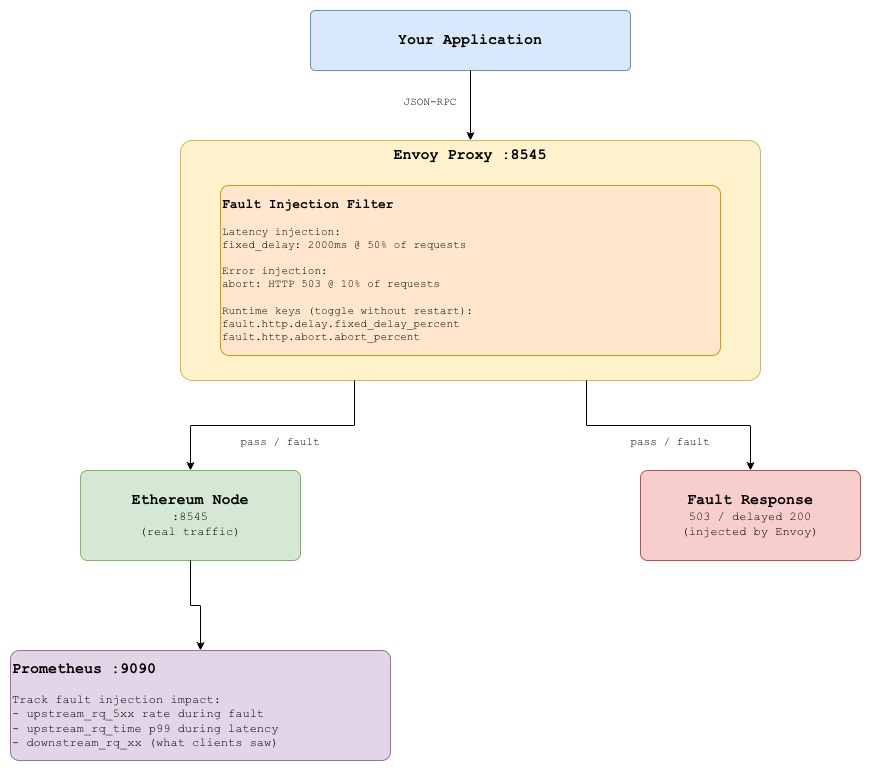
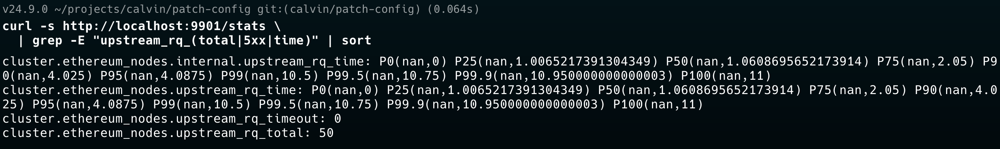
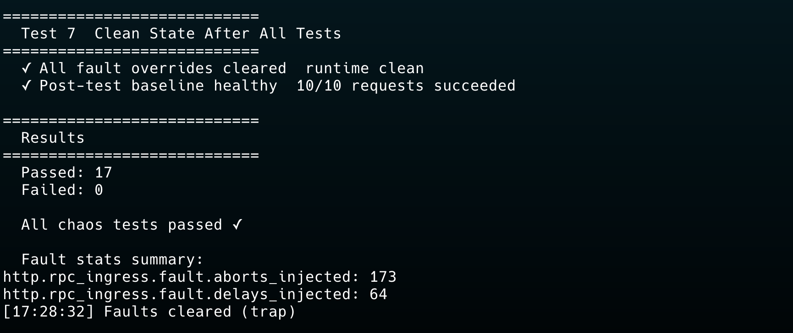

# Lab 05: Fault Injection for Blockchain RPC

## Overview

Circuit breakers, retries, and timeouts are only as good as the assumptions
baked into them. The only way to know they actually work is to break things
on purpose in a controlled environment, before production does it for you.

**Fault injection** is the practice of deliberately introducing failures into
a system to verify that its resilience mechanisms behave as designed. Envoy
has first class support for fault injection at the proxy layer: you can inject
latency, abort requests with arbitrary HTTP status codes, and combine both
all without touching application code, without modifying upstream services, and
without affecting traffic that is not explicitly targeted.

Applied to blockchain RPC infrastructure, fault injection lets you answer
questions that are otherwise impossible to test safely:

- Does your dApp handle `eth_sendRawTransaction` returning 503 without losing the transaction?
- What happens to your block sync logic when `eth_getBlockByNumber` is delayed 3 seconds?
- Does your WebSocket subscription handler reconnect when the proxy injects a connection reset?
- Does your alerting fire within SLA when the RPC node returns 50% errors?

This lab builds a complete fault injection test suite covering latency injection,
error injection, targeted method level faults, and gradual fault ramping the
same techniques used in production chaos engineering programs.

What you will learn:
- How Envoy fault injection works at the HTTP filter level
- How to target specific RPC methods with different fault profiles
- How to use runtime overrides to enable/disable faults without redeployment
- How to interpret the results and validate resilience mechanisms
- How to build a repeatable chaos test suite for RPC infrastructure


## Architecture



## Fault Injection Modes

| Mode | What it Does | Tests |
|------|-------------|-------|
| **Latency** | Adds delay before forwarding to upstream | Timeout handling, retry logic |
| **Abort** | Returns error response without hitting upstream | Error handling, fallback logic |
| **Latency + Abort** | Combination of both | Worst case degradation |
| **Targeted** | Faults on specific RPC methods only | Method level resilience |
| **Ramped** | Gradually increases fault percentage | Alert threshold validation |


## Fault Injection vs Chaos Engineering Tools

| | Envoy Fault Injection | Chaos Monkey / Gremlin |
|---|---|---|
| Layer | HTTP/L7 | Infrastructure / L3-L4 |
| Granularity | Per-route, per-method, per-header | Per-host, per-service |
| Blast radius | Single proxy rule | Can affect entire infrastructure |
| Activation | Runtime override (instant) | Separate tooling |
| RPC targeting | Yes  by path, header, method | No |
| Suitable for | RPC-level resilience testing | Infrastructure-level chaos |

Use Envoy fault injection for RPC resilience. Use infrastructure chaos tools
for testing node failures, network partitions, and disk exhaustion separately.


## Prerequisites

| Tool | Version | Install |
|------|---------|---------|
| Docker | >= 20.x | [docs.docker.com](https://docs.docker.com/get-docker/) |
| Docker Compose | >= 2.x | Included with Docker Desktop |
| curl | any | pre-installed |
| jq | any | `brew install jq` / `apt install jq` |
| hey | any | `brew install hey` |
| bc | any | `brew install bc` / `apt install bc` |


## Quick Start

```bash
git clone https://github.com/calvin-puram/envoy-web3-rpc-labs.git
cd envoy-web3-rpc-labs/fault-injection

docker compose up -d
docker compose ps
```


## Experiments

### Experiment 1: Baseline (No Faults)

Establish clean baseline metrics before injecting any faults:

```bash
# Send 50 requests record baseline latency and error rate
hey -n 50 -c 5 \
  -m POST \
  -H "Content-Type: application/json" \
  -d '{"jsonrpc":"2.0","method":"eth_blockNumber","params":[],"id":1}' \
  http://localhost:8545

# Record baseline stats
curl -s http://localhost:9901/stats \
  | grep -E "upstream_rq_(total|5xx|time)" | sort

# Verify faults are off
curl -s http://localhost:9901/runtime | jq '.entries | to_entries[] | select(.key | startswith("fault"))'
# Should return empty no fault overrides active
```


### Experiment 2: Latency Injection (Fixed Delay)

Add 2 seconds of latency to 50% of requests and verify your timeout handling:

```bash
# Enable latency injection via runtime override
curl -s -X POST http://localhost:9901/runtime_modify \
  --data "fault.http.delay.fixed_delay_percent=50"

# Confirm active
curl -s http://localhost:9901/runtime | jq '.entries'

# Send requests  ~50% should take 2s longer
hey -n 20 -c 5 \
  -m POST \
  -H "Content-Type: application/json" \
  -d '{"jsonrpc":"2.0","method":"eth_blockNumber","params":[],"id":1}' \
  http://localhost:8545

# Observe: two latency populations in hey output
# Fast:  ~5ms  (no fault)
# Slow:  ~2005ms (fault injected)

# Disable when done
curl -s -X POST http://localhost:9901/runtime_modify \
  --data "fault.http.delay.fixed_delay_percent=0"
```

**What to validate:** Does your application timeout correctly at 2s?
Does it retry? Does it surface an error to the user or silently hang?


### Experiment 3: Error Injection (HTTP 503)

Return 503 on 10% of requests and validate error handling:

```bash
# Enable error injection
curl -s -X POST http://localhost:9901/runtime_modify \
  --data "fault.http.abort.abort_percent=10"

# Send 100 requests — ~10 should return 503
for i in {1..100}; do
  STATUS=$(curl -s -o /dev/null -w "%{http_code}" \
    -X POST http://localhost:8545 \
    -H "Content-Type: application/json" \
    -d "{\"jsonrpc\":\"2.0\",\"method\":\"eth_blockNumber\",\"params\":[],\"id\":$i}")
  [ "$STATUS" != "200" ] && echo "Request $i: HTTP $STATUS"
done

# Check Envoy fault stats
curl -s http://localhost:9901/stats \
  | grep -E "(fault|downstream_rq_5xx)" | sort

# Disable
curl -s -X POST http://localhost:9901/runtime_modify \
  --data "fault.http.abort.abort_percent=0"
```

**What to validate:** Does your retry policy catch the 503s?
Check `upstream_rq_retry` stat — it should increase during fault injection.


### Experiment 4: Compound Fault (Latency + Error)

Combine latency and error injection to simulate a severely degraded node:

```bash
# Enable both simultaneously — worst case scenario
curl -s -X POST http://localhost:9901/runtime_modify \
  --data "fault.http.delay.fixed_delay_percent=30&fault.http.abort.abort_percent=20"

# Run load test under compound fault
hey -n 100 -c 10 \
  -m POST \
  -H "Content-Type: application/json" \
  -d '{"jsonrpc":"2.0","method":"eth_blockNumber","params":[],"id":1}' \
  http://localhost:8545

# Expected results:
# ~30% of requests: 2s delay then 200
# ~20% of requests: immediate 503
# ~50% of requests: normal

# Disable all faults
curl -s -X POST http://localhost:9901/runtime_modify \
  --data "fault.http.delay.fixed_delay_percent=0&fault.http.abort.abort_percent=0"
```

### Experiment 5: Targeted Fault: eth_getLogs Only

Inject faults on a specific RPC method without affecting others.
`eth_getLogs` is the most expensive method what happens when it degrades?

```bash
# Enable targeted latency on eth_getLogs route only
curl -s -X POST http://localhost:9901/runtime_modify \
  --data "fault.http.getlogs.delay_percent=100"

# Test: eth_getLogs should be slow
time curl -s -X POST http://localhost:8545 \
  -H "Content-Type: application/json" \
  -H "x-rpc-method: eth_getLogs" \
  -d '{"jsonrpc":"2.0","method":"eth_getLogs","params":[{"fromBlock":"latest"}],"id":1}'
# Expected: ~3s (injected delay)

# Test: eth_blockNumber should be fast (unaffected)
time curl -s -X POST http://localhost:8545 \
  -H "Content-Type: application/json" \
  -d '{"jsonrpc":"2.0","method":"eth_blockNumber","params":[],"id":1}'
# Expected: ~5ms (no fault)

# Disable
curl -s -X POST http://localhost:9901/runtime_modify \
  --data "fault.http.getlogs.delay_percent=0"
```

### Experiment 6: Gradual Fault Ramping

Gradually increase error rate to find the threshold where your alerting fires:

```bash
# Ramp fault from 0% to 50% in steps
for PERCENT in 5 10 20 30 50; do
  echo ""
  echo "── Fault at ${PERCENT}% ──"

  curl -s -X POST http://localhost:9901/runtime_modify \
    --data "fault.http.abort.abort_percent=${PERCENT}" > /dev/null

  # Send 50 requests
  ERRORS=0
  for i in {1..50}; do
    CODE=$(curl -s -o /dev/null -w "%{http_code}" \
      -X POST http://localhost:8545 \
      -H "Content-Type: application/json" \
      -d "{\"jsonrpc\":\"2.0\",\"method\":\"eth_blockNumber\",\"params\":[],\"id\":$i}")
    [ "$CODE" != "200" ] && ((ERRORS++))
  done

  echo "  Configured: ${PERCENT}% fault"
  echo "  Observed:   $((ERRORS * 2))% error rate ($ERRORS/50 requests)"
  sleep 5
done

# Reset
curl -s -X POST http://localhost:9901/runtime_modify \
  --data "fault.http.abort.abort_percent=0"
```

**What to validate:** At what error rate does your Prometheus alert fire?
Does your alerting SLO match the fault threshold where users notice impact?

### Experiment 7: Run the Full Chaos Test Suite

```bash
# Automated chaos test runs all fault scenarios and validates outcomes
bash script/chaos-test.sh
## Reading Fault Injection Stats

```bash
# All fault injection stats
curl -s http://localhost:9901/stats | grep fault | sort
```


| Stat | Meaning |
|------|---------|
| `http.rpc_ingress.fault.delays_injected` | Total latency faults injected |
| `http.rpc_ingress.fault.aborts_injected` | Total abort faults injected |
| `http.rpc_ingress.fault.response_rl` | Requests that hit rate limit fault |
| `cluster.ethereum_nodes.upstream_rq_retry` | Retries triggered by injected faults |
| `cluster.ethereum_nodes.upstream_rq_5xx` | 5xx responses (includes injected aborts) |

Key distinction: `fault.aborts_injected` counts faults injected **by Envoy**.
`upstream_rq_5xx` counts 5xx responses from **both** Envoy faults and real upstream errors.
During fault injection, compare both to understand how much of your error rate is real vs injected.


## Envoy Admin Dashboard

Open: **http://localhost:9901**

| Endpoint | What to Look For |
|----------|-----------------|
| `/stats` | `fault.delays_injected`, `fault.aborts_injected` |
| `/runtime` | Active fault configuration and percentages |
| `/config_dump` | Verify fault filter is loaded on the listener |


## Prometheus Metrics During Fault Injection

Open: **http://localhost:9090**

```promql
# Error rate during fault injection
rate(envoy_http_downstream_rq_xx{response_code_class="5xx"}[1m])

# Latency p99 (should spike during latency fault)
histogram_quantile(0.99,
  rate(envoy_cluster_upstream_rq_time_bucket[1m]))

# Fault injection counters
envoy_http_fault_delays_injected
envoy_http_fault_aborts_injected

# Retry rate (should increase when faults are active)
rate(envoy_cluster_upstream_rq_retry[1m])
```


## Key Envoy Concepts Used

### Fault Filter
```yaml
name: envoy.filters.http.fault
```
Envoy's built-in fault injection filter. Must appear **before** the router filter
in the filter chain. The order is critical filters execute top to bottom.

### Runtime Key Override
```yaml
delay_percent_runtime: fault.http.delay.fixed_delay_percent
abort_percent_runtime:  fault.http.abort.abort_percent
```
Links a runtime key to the fault percentage. When the key is not set, the
default percentage from config is used. Set to 0 to disable without restart.

### Percentage Object
```yaml
percentage:
  numerator: 50
  denominator: HUNDRED   # or TEN_THOUSAND for finer granularity
```
`HUNDRED` gives 1% granularity. Use `TEN_THOUSAND` for 0.01% granularity
when testing at high traffic volumes where coarse percentages are not precise enough.

### Header-Based Fault Targeting
```yaml
headers:
  - name: x-rpc-method
    string_match:
      exact: eth_getLogs
```
Target faults at specific RPC methods by matching on a header.
Requires clients to set `x-rpc-method` header, or use a Lua filter to extract
the method from the JSON body automatically.


## Fault Injection Safety Rules

```
1. Always start at low percentages (1-5%) and increase gradually
2. Never run fault injection against production without a kill switch
3. Document every fault test what was injected, duration, observed impact
4. Disable all faults before ending a test session
5. Verify faults are disabled: curl http://localhost:9901/runtime | jq .
6. Keep blast radius small target specific routes before global faults
7. Run fault tests during low traffic windows in staging
```


## Cleanup

```bash
# Disable all faults first
curl -s -X POST http://localhost:9901/runtime_modify \
  --data "fault.http.delay.fixed_delay_percent=0&fault.http.abort.abort_percent=0"

# Tear down
docker compose down -v
```

## References

- [Envoy Fault Injection Filter](https://www.envoyproxy.io/docs/envoy/latest/configuration/http/http_filters/fault_filter)
- [Principles of Chaos Engineering](https://principlesofchaos.org/)
- [Google SRE Book Testing for Reliability](https://sre.google/sre-book/testing-reliability/)
- [Netflix Chaos Engineering](https://netflixtechblog.com/the-netflix-simian-army-16e57fbab116)