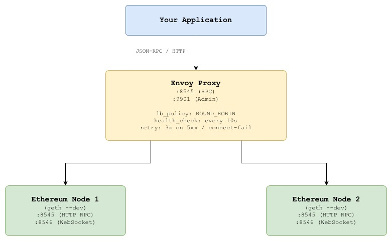
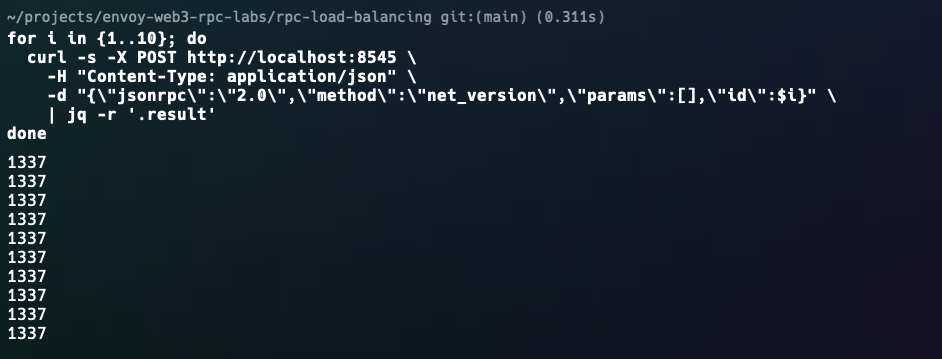
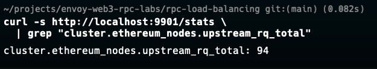
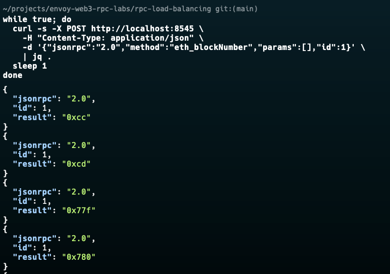
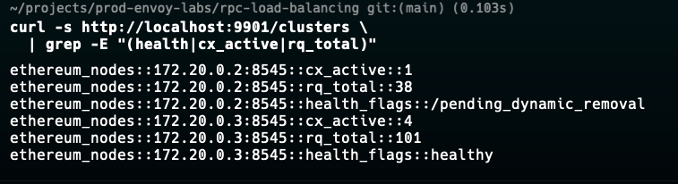
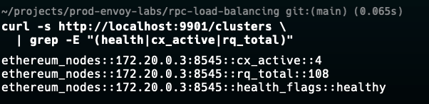
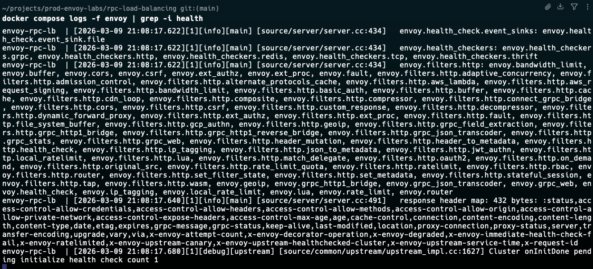
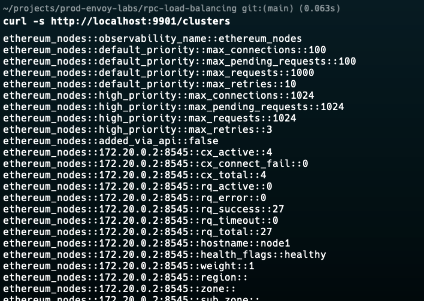

# Lab 01: RPC Load Balancing Across Ethereum Nodes

## Overview

Most Web3 teams run a single Ethereum RPC node as their primary endpoint. This creates a single point of failure when the node goes down, the application goes down.

This lab demonstrates how to use **Envoy Proxy** as a smart layer-7 load balancer in front of multiple Ethereum nodes, providing:

- Automatic traffic distribution across nodes
- Active health checking with automatic failover
- Zero-downtime node restarts
- Per-endpoint observability via Envoy admin API


## Architecture



## Prerequisites

| Tool | Version | Install |
|------|---------|---------|
| Docker | >= 20.x | [docs.docker.com](https://docs.docker.com/get-docker/) |
| Docker Compose | >= 2.x | Included with Docker Desktop |
| curl | any | pre-installed on most systems |
| jq | any | `brew install jq` / `apt install jq` |


## Quick Start

```bash
# Clone the repo
git clone https://github.com/calvin-puram/envoy-web3-rpc-labs.git
cd envoy-web3-rpc-labs/load-balancing

# Start all services
docker compose up -d

# Verify everything is running
docker compose ps
```


## Experiments

### Experiment 1: Verify Load Balancing

Send 10 RPC requests through Envoy and observe the distribution:

```bash
for i in {1..10}; do
  curl -s -X POST http://localhost:8545 \
    -H "Content-Type: application/json" \
    -d "{\"jsonrpc\":\"2.0\",\"method\":\"net_version\",\"params\":[],\"id\":$i}" \
    | jq -r '.result'
done
```



Check request counts per upstream node in Envoy admin:

```bash
curl -s http://localhost:9901/stats \
  | grep "cluster.ethereum_nodes.upstream_rq_total"
```




### Experiment 2: Automatic Failover

Simulate a node failure and observe Envoy routing around it:

```bash
# Terminal 1: continuously send requests
watch -n 1 'curl -s -X POST http://localhost:8545 \
  -H "Content-Type: application/json" \
  -d "{\"jsonrpc\":\"2.0\",\"method\":\"eth_blockNumber\",\"params\":[],\"id\":1}" \
  | jq .'

# Terminal 2: kill node1
docker compose stop node1

# Observe: requests keep succeeding via node2
# Envoy detects the failure within 3 failed health checks (~30s)
```


Check Envoy cluster health:

```bash
curl -s http://localhost:9901/clusters \
  | grep -E "(health|cx_active|rq_total)"
```





### Experiment 3: Node Recovery

Bring the failed node back and observe automatic pool re-entry:

```bash
# Bring node1 back
docker compose start node1

# Watch health checks in Envoy logs
docker compose logs -f envoy | grep -i health


# After 2 successful health checks, node1 rejoins the pool
# Verify both nodes are healthy again
curl -s http://localhost:9901/clusters | grep -A2 "health_flags"
```



### Experiment 4: Observe Per-Node Metrics

```bash
# Full cluster stats
curl -s http://localhost:9901/clusters

# Specific metrics
curl -s http://localhost:9901/stats | grep ethereum_nodes | sort

# Key metrics to look for:
# upstream_rq_total         - total requests per endpoint
# upstream_cx_active        - active connections
# health_check.success      - successful health checks
# health_check.failure      - failed health checks
# upstream_rq_retry         - retried requests
```



## Envoy Admin Dashboard

Open in your browser: **http://localhost:9901**

| Endpoint | Description |
|----------|-------------|
| `/clusters` | Upstream node health and stats |
| `/stats` | All Envoy metrics |
| `/listeners` | Active listeners |
| `/config_dump` | Full running config |
| `/ready` | Envoy readiness check |


## Key Envoy Concepts Used

### Round Robin Load Balancing
```yaml
lb_policy: ROUND_ROBIN
```
Distributes requests evenly across all healthy upstream nodes in sequence.

### Active Health Checking
```yaml
health_checks:
  - interval: 10s
    unhealthy_threshold: 3    # 3 failures → mark unhealthy
    healthy_threshold: 2      # 2 successes → mark healthy again
    http_health_check:
      path: "/"
```
Envoy proactively polls each node. Unhealthy nodes are removed from rotation without manual intervention.

### Retry Policy
```yaml
retry_policy:
  retry_on: "5xx,reset,connect-failure"
  num_retries: 3
```
Automatically retries failed requests against a different upstream node.


## Cleanup

```bash
docker compose down -v
```


## What's Next

- **[RPC Rate Limiting](../rate-limiting/)**  protect your nodes from being overwhelmed
- **[Circuit Breaking](../circuit-breaking/)**  fail fast when nodes are degraded


## References

- [Envoy Load Balancing Documentation](https://www.envoyproxy.io/docs/envoy/latest/intro/arch_overview/upstream/load_balancing/load_balancing)
- [Envoy Health Checking](https://www.envoyproxy.io/docs/envoy/latest/intro/arch_overview/upstream/health_checking)
- [go-ethereum Dev Mode](https://geth.ethereum.org/docs/developers/dapp-developer/dev-mode)