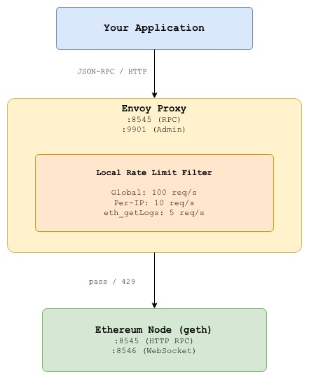
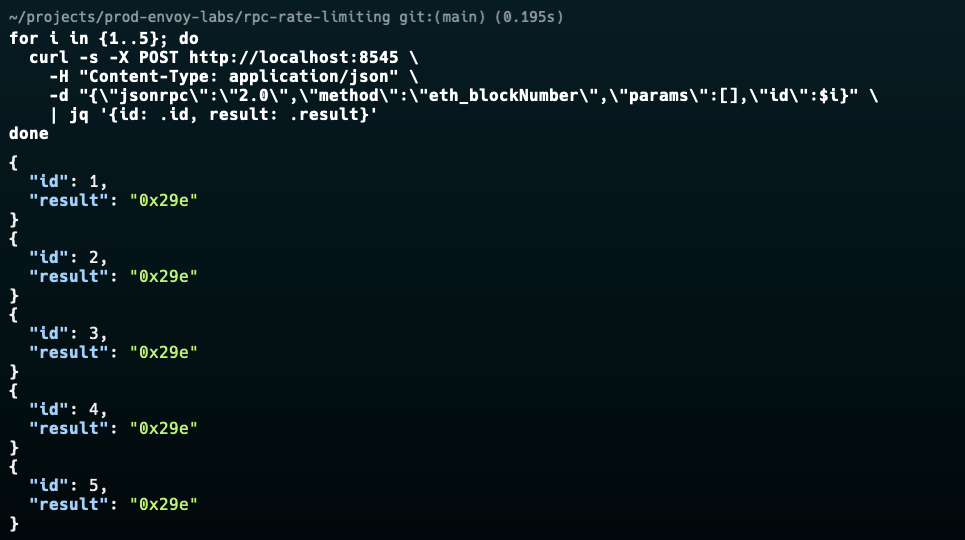
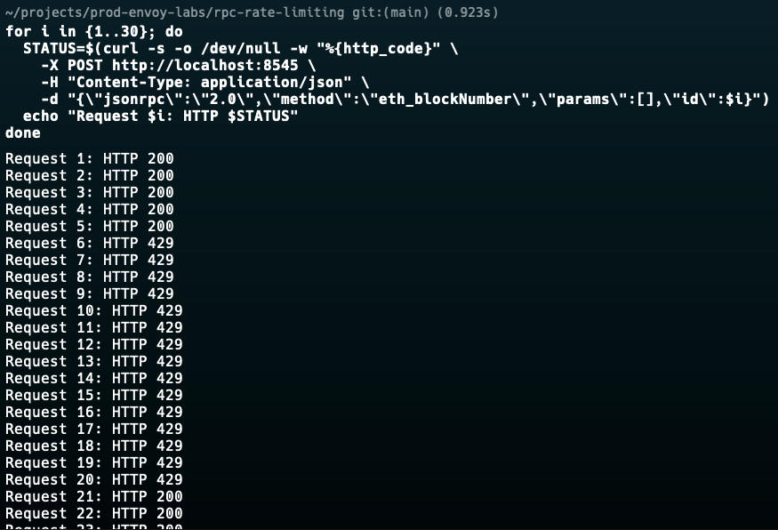
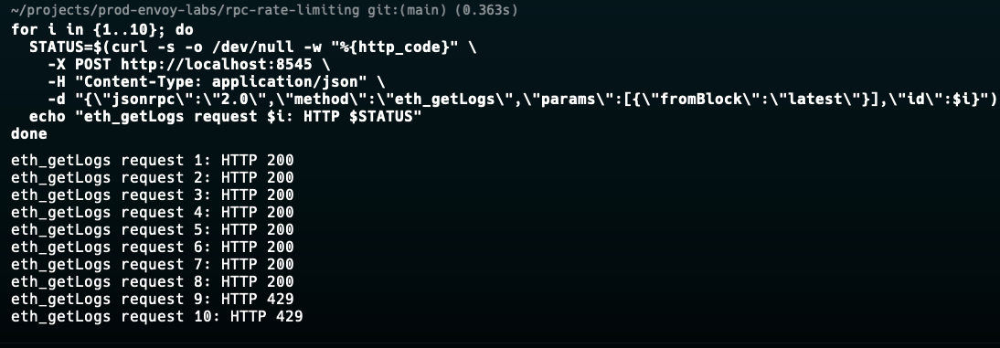
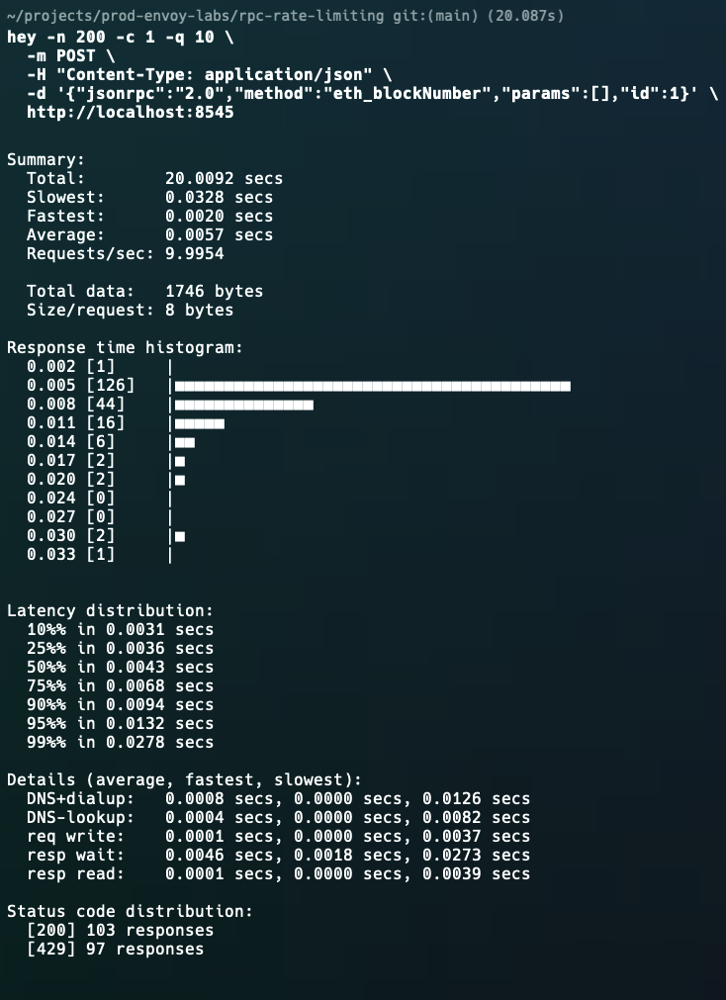
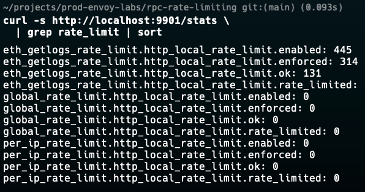

# Lab 02: RPC Rate Limiting

## Overview

Public and private RPC endpoints are frequent targets of abuse bots, misconfigured clients, and runaway retry loops can saturate a node in seconds. Without rate limiting, a single bad actor can degrade service for every other consumer.

This lab demonstrates how to use **Envoy's local rate limiter** to enforce per-IP request limits at the proxy layer before traffic ever reaches your Ethereum node. No application code changes required.

What you will learn:
- How to configure token bucket rate limiting in Envoy
- How to differentiate limits by RPC method (e.g. stricter limits on `eth_getLogs`)
- How to return meaningful `429 Too Many Requests` responses with `Retry-After` headers
- How to observe rate limit hits via Envoy stats


## Architecture




## Rate Limit Strategy

| Scope | Limit | Burst | Rationale |
|-------|-------|-------|-----------|
| Global | 100 req/s | 200 | Total node capacity protection |
| Per IP | 10 req/s | 20 | Fair usage per consumer |
| `eth_getLogs` | 5 req/s | 5 | Expensive query  strict limit |
| `eth_call` | 20 req/s | 40 | Common but bounded |


## Prerequisites

| Tool | Version | Install |
|------|---------|---------|
| Docker | >= 20.x | [docs.docker.com](https://docs.docker.com/get-docker/) |
| Docker Compose | >= 2.x | Included with Docker Desktop |
| curl | any | pre-installed on most systems |
| jq | any | `brew install jq` / `apt install jq` |
| hey | any | `brew install hey` (HTTP load testing) |


## Quick Start

```bash
# Clone the repo
git clone https://github.com/calvin-puram/envoy-web3-rpc-labs.git
cd envoy-web3-rpc-labs/rate-limiting

# Start all services
docker compose up -d

# Verify everything is running
docker compose ps
```


## Experiments

### Experiment 1: Normal Traffic Passes Through

Send a few requests, these should all succeed:

```bash
for i in {1..5}; do
  curl -s -X POST http://localhost:8545 \
    -H "Content-Type: application/json" \
    -d "{\"jsonrpc\":\"2.0\",\"method\":\"eth_blockNumber\",\"params\":[],\"id\":$i}" \
    | jq '{id: .id, result: .result}'
done
```

Expected: all return `200 OK` with block number results.



### Experiment 2: Trigger Per-IP Rate Limit

Burst 30 requests rapidly from the same IP to exceed the 10 req/s limit:

```bash
# Send 30 requests as fast as possible
for i in {1..30}; do
  STATUS=$(curl -s -o /dev/null -w "%{http_code}" \
    -X POST http://localhost:8545 \
    -H "Content-Type: application/json" \
    -d "{\"jsonrpc\":\"2.0\",\"method\":\"eth_blockNumber\",\"params\":[],\"id\":$i}")
  echo "Request $i: HTTP $STATUS"
done
```


### Experiment 3: eth_getLogs Strict Limiting

`eth_getLogs` is one of the most resource-intensive RPC methods.
It has a stricter limit of 5 req/s:

```bash
# Burst 10 eth_getLogs requests
for i in {1..10}; do
  STATUS=$(curl -s -o /dev/null -w "%{http_code}" \
    -X POST http://localhost:8545 \
    -H "Content-Type: application/json" \
    -d "{\"jsonrpc\":\"2.0\",\"method\":\"eth_getLogs\",\"params\":[{\"fromBlock\":\"latest\"}],\"id\":$i}")
  echo "eth_getLogs request $i: HTTP $STATUS"
done
```

Expected: hits 429 much sooner than `eth_blockNumber` due to tighter limit. The exact cutoff point varies slightly depending on how fast curl executes each request.



### Experiment 4: Load Test with hey

Use `hey` to simulate realistic concurrent traffic and observe rate limiting behavior:

```bash
# 50 concurrent users, 200 total requests
hey -n 200 -c 1 -q 10 \
  -m POST \
  -H "Content-Type: application/json" \
  -d '{"jsonrpc":"2.0","method":"eth_blockNumber","params":[],"id":1}' \
  http://localhost:8545
```

Look for the `Status code distribution` section in the output:
```
Status code distribution:
  [200] 100 responses    passed through
  [429] 100 responses    rate limited
```



### Experiment 5: Observe Rate Limit Stats

```bash
# Total rate limited requests
curl -s http://localhost:9901/stats \
  | grep rate_limit | sort

# Key metrics:
# http_local_rate_limit.enabled              - total requests evaluated
# http_local_rate_limit.rate_limited         - requests that were limited
# http_local_rate_limit.ok                   - requests that passed

# Watch in real time while sending traffic
watch -n 1 'curl -s http://localhost:9901/stats | grep rate_limit'
```



### Experiment 6: Inspect the 429 Response Headers

```bash
curl -v -X POST http://localhost:8545 \
  -H "Content-Type: application/json" \
  -d '{"jsonrpc":"2.0","method":"eth_blockNumber","params":[],"id":1}' \
  2>&1 | grep -E "(< HTTP|< x-rate|< retry|< content)"
```

Expected headers on a rate limited response:
```
< HTTP/1.1 429 Too Many Requests
< x-rate-limit-limit: 10
< x-rate-limit-remaining: 0
< retry-after: 1
< content-type: application/json
```


## Envoy Admin Dashboard

Open in your browser: **http://localhost:9901**

| Endpoint | What to Look For |
|----------|-----------------|
| `/stats` | `http_local_rate_limit.rate_limited` counter |
| `/clusters` | Upstream request counts (should be lower than total incoming) |
| `/config_dump` | Verify rate limit filter config is loaded |


## Key Envoy Concepts Used

### Local Rate Limit Filter
```yaml
name: envoy.filters.http.local_ratelimit
```
Envoy's built-in token bucket rate limiter. Runs entirely in process no external rate limit service required. Each Envoy instance maintains its own counters.

### Token Bucket Algorithm
```
fill_interval: 1s
max_tokens: 10       bucket capacity (burst)
tokens_per_fill: 10  refill rate per interval

Request arrives:
  tokens > 0  consume 1 token, allow request
  tokens = 0  reject with 429
```

### Per-Route Overrides
Different limits per RPC method without running multiple proxies:
```yaml
# Default: 10 req/s
# eth_getLogs route: 5 req/s (overrides default)
# eth_call route:   20 req/s (overrides default)
```

### Custom Response on Rate Limit
```yaml
response_headers_to_add:
  - header:
      key: retry-after
      value: "1"
```
Tells clients exactly when to retry — prevents aggressive retry storms.


## Tuning Guidance

| Scenario | Recommendation |
|----------|---------------|
| Public RPC endpoint | Per-IP: 5-10 req/s, Global: 500 req/s |
| Private/internal | Per-IP: 50-100 req/s, Global: 1000 req/s |
| Archive node | Per-IP: 2-5 req/s (expensive queries) |
| Websocket subscriptions | Use connection limits, not rate limits |


## Cleanup

```bash
docker compose down -v
```


## What's Next

- **[WebSocket Management](../websocket-management/)**  handle long-lived WebSocket connections to blockchain nodes
- **[Circuit Breaking](../circuit-breaking/)**  fail fast when nodes are degraded


## References

- [Envoy Local Rate Limit Filter](https://www.envoyproxy.io/docs/envoy/latest/configuration/http/http_filters/local_rate_limit_filter)
- [Token Bucket Algorithm](https://en.wikipedia.org/wiki/Token_bucket)
- [Ethereum JSON-RPC API](https://ethereum.org/en/developers/docs/apis/json-rpc/)
- [Understanding Logs: Deep Dive into eth_getLogs](https://www.alchemy.com/docs/deep-dive-into-eth_getlogs)