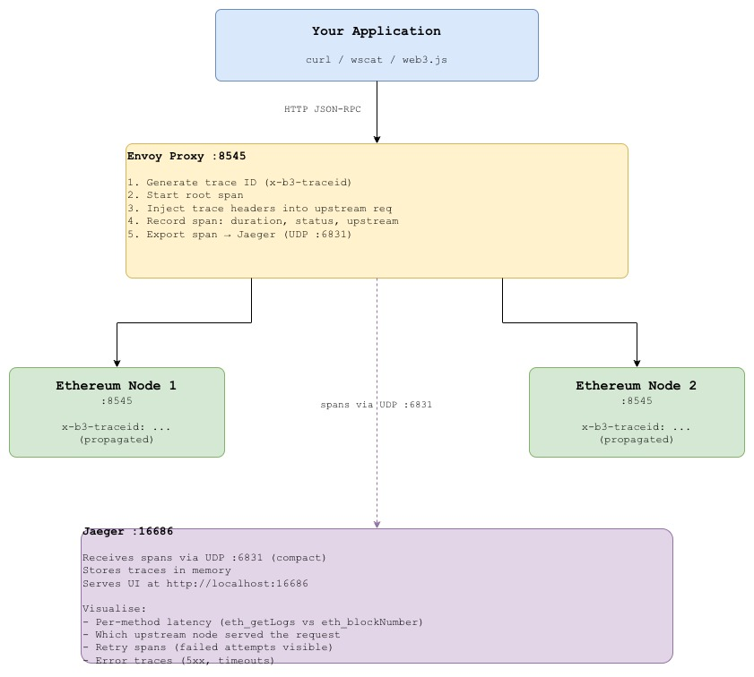

# Lab 04 — Distributed Tracing for Blockchain RPC

## Overview

When an RPC call fails or is slow, the standard debugging workflow is to grep logs across multiple services and mentally stitch together a timeline. This works for simple setups but breaks down quickly when you have multiple Envoy proxies, multiple nodes, and latency that only manifests under load.

**Distributed tracing** solves this by propagating a unique trace ID through every hop of a request from the client through Envoy, into the Ethereum node, and back. Every span in the trace is recorded with timing, metadata, and status. The result is a complete visual timeline of exactly where time was spent and where failures occurred.

This lab demonstrates how to instrument Envoy with **Zipkin-compatible tracing** and visualise traces in **Jaeger**, with a focus on the RPC methods that matter most for blockchain operations.

What you will learn:
- How distributed tracing works at the proxy layer (no application code changes)
- How to identify slow RPC methods using p50/p95/p99 latency from trace data
- How to correlate Envoy access logs with Jaeger traces using trace IDs
- How to set sampling rates appropriate for production traffic volumes
- How to spot upstream node performance differences from trace data


## Architecture


## Trace Propagation Headers

Envoy uses the **B3 propagation format** (Zipkin-compatible, supported by Jaeger):

| Header | Purpose | Example |
|--------|---------|---------|
| `x-b3-traceid` | Unique ID for the entire request chain | `463ac35c9f6413ad` |
| `x-b3-spanid` | ID for this specific hop | `a2fb4a1d1a96d312` |
| `x-b3-parentspanid` | ID of the calling span | `0020000000000001` |
| `x-b3-sampled` | Whether this trace is being recorded | `1` (yes) / `0` (no) |
| `x-request-id` | Envoy's own request ID (correlates with access logs) | `uuid-v4` |


## Prerequisites

| Tool | Version | Install |
|------|---------|---------|
| Docker | >= 20.x | [docs.docker.com](https://docs.docker.com/get-docker/) |
| Docker Compose | >= 2.x | Included with Docker Desktop |
| curl | any | pre-installed |
| jq | any | `brew install jq` / `apt install jq` |
| hey | any | `brew install hey` (load testing) |


## Quick Start

```bash
# Clone the repo
git clone https://github.com/calvin-puram/envoy-web3-rpc-labs.git
cd envoy-web3-rpc-labs/tracing

# Start infrastructure (Jaeger + supporting services)
docker compose -f jaeger-compose.yml up -d

# Start Envoy + Ethereum nodes
docker compose up -d

# Verify all services are running
docker compose ps
docker compose -f jaeger-compose.yml ps
```

Open Jaeger UI: **http://localhost:16686**


## Experiments

### Experiment 1: Generate Your First Trace

Send a single RPC request and find its trace in Jaeger:

```bash
# Send request  note the x-request-id in the response headers
curl -v -X POST http://localhost:8545 \
  -H "Content-Type: application/json" \
  -d '{"jsonrpc":"2.0","method":"eth_blockNumber","params":[],"id":1}' \
  2>&1 | grep -E "(< x-request-id|< x-b3-traceid|result)"
```

Then in Jaeger UI:
```
http://localhost:16686
=> Service: envoy
=> Operation: egress
=> Find Traces
=> Click the trace
=> See: duration, upstream host, status code
```

### Experiment 2: Compare RPC Method Latency

Generate traces for different RPC methods and compare their latency profiles:

```bash
# Fast method simple state query
for i in {1..20}; do
  curl -s -X POST http://localhost:8545 \
    -H "Content-Type: application/json" \
    -d "{\"jsonrpc\":\"2.0\",\"method\":\"eth_blockNumber\",\"params\":[],\"id\":$i}" \
    > /dev/null
done

# Slower method requires log scanning
for i in {1..20}; do
  curl -s -X POST http://localhost:8545 \
    -H "Content-Type: application/json" \
    -d "{\"jsonrpc\":\"2.0\",\"method\":\"eth_getLogs\",\"params\":[{\"fromBlock\":\"0x0\",\"toBlock\":\"latest\"}],\"id\":$i}" \
    > /dev/null
done

# eth_call EVM execution
for i in {1..20}; do
  curl -s -X POST http://localhost:8545 \
    -H "Content-Type: application/json" \
    -d "{\"jsonrpc\":\"2.0\",\"method\":\"eth_call\",\"params\":[{\"to\":\"0x0000000000000000000000000000000000000000\",\"data\":\"0x\"},\"latest\"],\"id\":$i}" \
    > /dev/null
done
```

In Jaeger:
```
=> Service: envoy
=> Operation: egress
=> Tags: http.url=/
=> Compare trace durations across methods
=> Look for outliers in eth_getLogs
```


### Experiment 3: Trace a Slow Request

Inject artificial latency and observe it in the trace timeline:

```bash
# Send 50 requests with load some will be slower under concurrency
hey -n 50 -c 10 \
  -m POST \
  -H "Content-Type: application/json" \
  -d '{"jsonrpc":"2.0","method":"eth_getLogs","params":[{"fromBlock":"0x0","toBlock":"latest"}],"id":1}' \
  http://localhost:8545

# In Jaeger: sort traces by duration (slowest first)
# http://localhost:16686 => Find Traces => Sort: Longest First
```


### Experiment 4: Identify Which Node Served the Request

Every trace includes the upstream host. Use this to spot per-node performance differences:

```bash
# Send 20 requests
for i in {1..20}; do
  curl -s -X POST http://localhost:8545 \
    -H "Content-Type: application/json" \
    -d "{\"jsonrpc\":\"2.0\",\"method\":\"eth_blockNumber\",\"params\":[],\"id\":$i}" \
    > /dev/null
done
```

In Jaeger UI, look at individual traces and check the `upstream_cluster` tag:
```
Tags:
  http.status_code: 200
  upstream_cluster:  ethereum_nodes
  node.id:          envoy
  component:        proxy
```

In Envoy access logs — correlate by `x-request-id`:
```bash
docker compose logs envoy | grep "x-request-id" | tail -20
```


### Experiment 5: Trace a Failed Request

Simulate a node failure and observe error traces in Jaeger:

```bash
# Terminal 1 keep sending requests
for i in {1..30}; do
  curl -s -o /dev/null -w "Request $i: %{http_code}\n" \
    -X POST http://localhost:8545 \
    -H "Content-Type: application/json" \
    -d "{\"jsonrpc\":\"2.0\",\"method\":\"eth_blockNumber\",\"params\":[],\"id\":$i}"
  sleep 0.5
done

# Terminal 2 kill node1 mid-way
sleep 8 && docker compose stop node1
```

In Jaeger:
```
=> Tags: http.status_code=503
=> Find failed traces
=> See: retry spans, error tags, which upstream was tried
```

Retry spans will appear as child spans you can see each attempt and which node it targeted.


### Experiment 6: Correlate Trace ID with Envoy Logs

Every Envoy access log line contains the `x-request-id`. Use it to pull the full trace:

```bash
# Get a request ID from Envoy logs
docker compose logs envoy 2>&1 \
  | grep "x-request-id" \
  | tail -5 \
  | grep -oP 'x-request-id=\K[^ ]+'
```

Copy the request ID and search in Jaeger:
```
http://localhost:16686
→ Search by Tags
→ http.x-request-id: <paste-id-here>
→ Find exact trace for that request
```


### Experiment 7: Adjust Sampling Rate

100% sampling is fine for dev but too expensive for production. Test different rates:

```bash
# Current: 100% sampling (every request traced)
# Edit envoy.yaml → tracing.provider.typed_config.collector_cluster

# Check trace volume at 100%
curl -s http://localhost:9901/stats | grep tracing

# Key stats:
# tracing.zipkin.spans_sent      spans exported to Jaeger
# tracing.zipkin.timer_flushed   flush cycles
```

For production guidance:
```
Low traffic  (< 100 req/s):   100% sampling  trace everything
Medium traffic (100-1000/s):   10% sampling
High traffic  (> 1000 req/s):   1% sampling + always sample errors
```


## Jaeger UI Guide

Open: **http://localhost:16686**

| Feature | Where to Find It | What to Look For |
|---------|-----------------|-----------------|
| All traces | Search → Service: envoy | Request volume over time |
| Slow requests | Search → Min Duration: 100ms | Latency outliers |
| Errors only | Search → Tags: error=true | Failed RPC calls |
| Method breakdown | Search → Operation | Compare eth_getLogs vs eth_blockNumber |
| Trace timeline | Click any trace | Span waterfall, upstream host |
| System architecture | System Architecture tab | Service dependency map |


## Key Envoy Concepts Used

### Zipkin Tracer
```yaml
provider:
  name: envoy.tracers.zipkin
  typed_config:
    "@type": ...OpenCensusConfig
    zipkin_exporter_config:
      url: "http://jaeger:9411/api/v2/spans"
```
Envoy's built-in Zipkin tracer. Jaeger accepts Zipkin format  no custom collector needed.

### Trace Sampling
```yaml
overall_sampling:
  value: 100.0   # 100% in dev reduce for production
```
Controls what percentage of requests generate traces. High sampling = more visibility, more overhead.

### Custom Tags on Spans
```yaml
custom_tags:
  - tag: rpc.node
    literal:
      value: "ethereum-rpc"
  - tag: lab
    literal:
      value: "04-rpc-tracing"
```
Adds searchable metadata to every span makes filtering in Jaeger much more useful.


## Cleanup

```bash
docker compose down -v
docker compose -f jaeger-compose.yml down -v
```


## What's Next

- **[Circuit Breaking](../circuit-breaking/)**  use trace data to identify which nodes need circuit breaking
- **[Canary Routing](../canary-routing/)**  trace canary vs stable traffic separately


## References

- [Envoy Distributed Tracing](https://www.envoyproxy.io/docs/envoy/latest/intro/arch_overview/observability/tracing)
- [Jaeger Documentation](https://www.jaegertracing.io/docs/)
- [B3 Propagation Format](https://github.com/openzipkin/b3-propagation)
- [OpenTelemetry Trace Context](https://www.w3.org/TR/trace-context/)