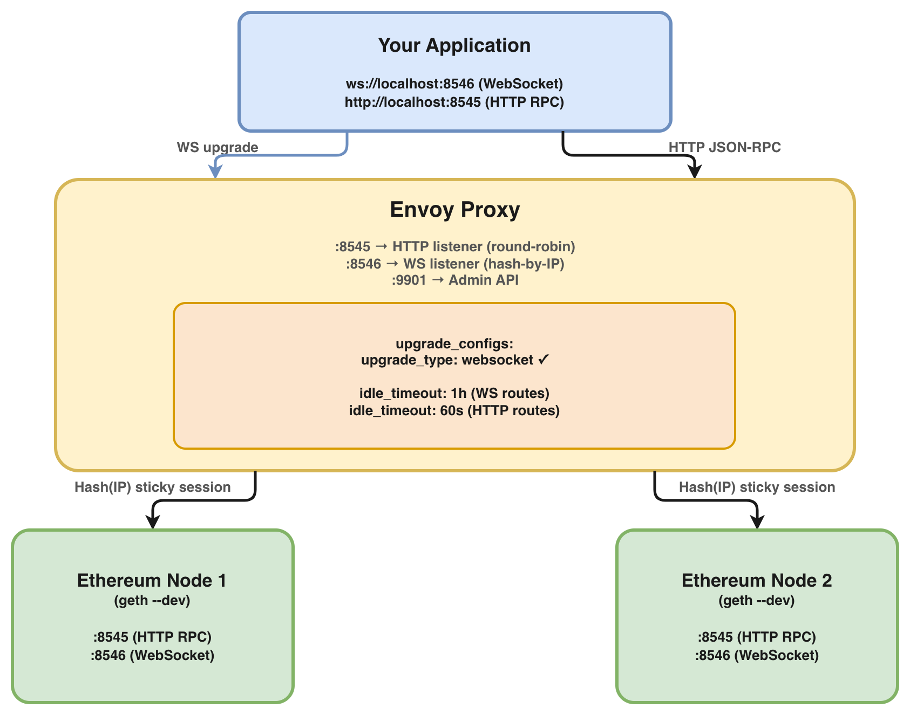
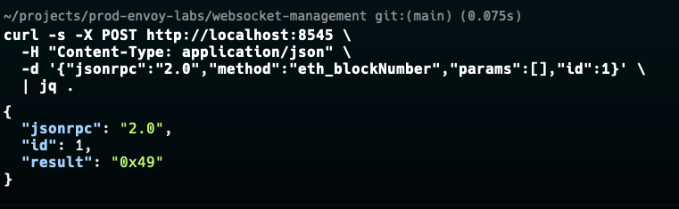
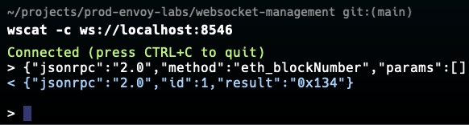
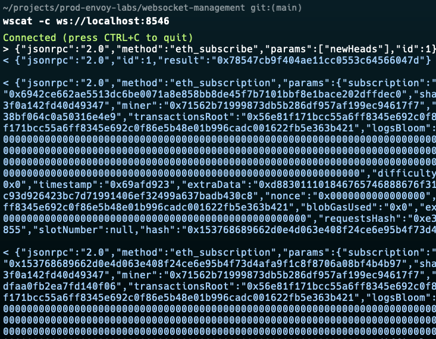
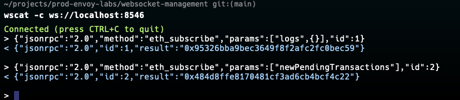

# Lab 03: WebSocket Management for Blockchain Subscriptions

## Overview

HTTP JSON-RPC is stateless. If you send a req, you get an answer. But blockchain applications often need to **react to events as they happen**: new blocks, pending transactions, log emissions. For this, Ethereum nodes expose a WebSocket endpoint that supports long-lived connections and push based subscriptions via `eth_subscribe`.


In this lab, I demonstrates how you can configure Envoy to handle webSocket upgrade negotiation, configure per route idle timeouts for long lived connections, how to use hash based load balancing for subscription stickiness, how to test WebSocket connections and subscriptions end-to-end and finally how to observe active WebSocket connections via Envoy stats


## Architecture



## WebSocket vs HTTP

| Property | HTTP JSON-RPC | WebSocket |
|----------|--------------|-----------|
| Connection | New per request | Persistent, long-lived |
| Direction | Client → Server | Bidirectional |
| Use case | `eth_call`, `eth_getBalance` | `eth_subscribe` (blocks, logs, txs) |
| Proxy timeout | 30–60s fine | Must be hours or disabled |
| Load balancing | Any algorithm | Hash-based (sticky) |
| Upgrade header | Not needed | Required (`Upgrade: websocket`) |


## Prerequisites

| Tool | Version | Install |
|------|---------|---------|
| Docker | >= 20.x | [docs.docker.com](https://docs.docker.com/get-docker/) |
| Docker Compose | >= 2.x | Included with Docker Desktop |
| websocat | any | `brew install websocat` |
| wscat | any | `npm install -g wscat` |
| curl | any | pre-installed on most systems |
| jq | any | `brew install jq` / `apt install jq` |


## Quick Start

```bash
# Clone the repo
git clone https://github.com/calvin-puram/envoy-web3-rpc-labs.git
cd envoy-web3-rpc-labs/websocket-management

# Start all services
docker compose up -d

# Verify everything is running
docker compose ps
```

## Experiments

### Experiment 1: Verify HTTP RPC Still Works

HTTP RPC and WebSocket run on separate listeners. Confirm HTTP is unaffected:

```bash
curl -s -X POST http://localhost:8545 \
  -H "Content-Type: application/json" \
  -d '{"jsonrpc":"2.0","method":"eth_blockNumber","params":[],"id":1}' \
  | jq .
```



### Experiment 2: Establish a WebSocket Connection

Connect to Envoy's WebSocket listener and send a basic RPC call:

```bash
# Using websocat
echo '{"jsonrpc":"2.0","method":"eth_blockNumber","params":[],"id":1}' \
  | websocat ws://localhost:8546

# Using wscat (interactive)
wscat -c ws://localhost:8546
> {"jsonrpc":"2.0","method":"eth_blockNumber","params":[],"id":1}
```



### Experiment 3: Subscribe to New Blocks

The primary reason to use WebSocket is receive new block headers as they are mined:

```bash
# Open interactive WebSocket session
wscat -c ws://localhost:8546

# Subscribe to new block headers
> {"jsonrpc":"2.0","method":"eth_subscribe","params":["newHeads"],"id":1}

# You will receive:
< {"jsonrpc":"2.0","id":1,"result":"0xcd0c3e8af590364c09d0fa6a1210faf5"}

# Then automatically receive a notification every ~1s (--dev.period=1):
< {
    "jsonrpc": "2.0",
    "method": "eth_subscription",
    "params": {
      "subscription": "0xcd0c3e8af590364c09d0fa6a1210faf5",
      "result": {
        "number": "0x1b",
        "hash": "0xabc...",
        "parentHash": "0xdef...",
        ...
      }
    }
  }
```



### Experiment 4: Subscribe to Contract Logs

Subscribe to all events emitted on the network:

```bash
wscat -c ws://localhost:8546

# Subscribe to all logs
> {"jsonrpc":"2.0","method":"eth_subscribe","params":["logs",{}],"id":1}

# Subscribe to pending transactions
> {"jsonrpc":"2.0","method":"eth_subscribe","params":["newPendingTransactions"],"id":2}
```



### Experiment 5: Verify Session Stickiness

WebSocket subscriptions are stateful they must stick to the same upstream node.
Verify that multiple connections from the same IP always land on the same node:

```bash
# Open 3 WebSocket connections simultaneously
# All from same IP should all route to same upstream node

# Terminal 1
wscat -c ws://localhost:8546 &
# Terminal 2
wscat -c ws://localhost:8546 &
# Terminal 3
wscat -c ws://localhost:8546 &

# Check which upstream node each connection landed on
curl -s http://localhost:9901/clusters \
  | grep -A5 "ethereum_ws_nodes"
```

Then open a connection from a different source IP and verify it may land on a different node:

```bash
# Simulate different IP using Docker network
docker run --rm --network 03-websocket-management_default \
  appropriate/curl \
  -X POST http://envoy:8546 \
  -H "Upgrade: websocket" \
  -H "Connection: Upgrade"
```


### Experiment 6: Test Idle Timeout Behavior

HTTP connections time out at 60s. WebSocket connections survive for 1 hour:

```bash
# Establish a WebSocket connection and leave it idle
wscat -c ws://localhost:8546

# Wait 70 seconds
sleep 70

# Try sending a message should still be alive
> {"jsonrpc":"2.0","method":"eth_blockNumber","params":[],"id":1}

# Compare: direct HTTP connection drops after 60s idle
```

Check active connection count:
```bash
# Active WebSocket connections (cx_active)
curl -s http://localhost:9901/stats \
  | grep "cluster.ethereum_ws_nodes.*cx_active"
```


### Experiment 7: Observe WebSocket Stats

```bash
# All WebSocket-related metrics
curl -s http://localhost:9901/stats \
  | grep -E "(websocket|upgrade|cx_active|cx_total)" | sort

# Key metrics to watch:
# cluster.ethereum_ws_nodes.upstream_cx_active          live connections
# cluster.ethereum_ws_nodes.upstream_cx_total           total ever opened
# http.rpc_ws_ingress.downstream_cx_upgrades_http_websocket  upgrade count
# cluster.ethereum_ws_nodes.upstream_rq_total           messages sent

# Watch active connections in real time
watch -n 2 'curl -s http://localhost:9901/stats \
  | grep "upstream_cx_active"'
```


### Experiment 8: Unsubscribe Cleanly

Always unsubscribe before closing avoids ghost subscriptions on the node:

```bash
wscat -c ws://localhost:8546

# Subscribe
> {"jsonrpc":"2.0","method":"eth_subscribe","params":["newHeads"],"id":1}
< {"jsonrpc":"2.0","id":1,"result":"0xcd0c3e8af590364c09d0fa6a1210faf5"}

# Unsubscribe using the subscription ID from above
> {"jsonrpc":"2.0","method":"eth_unsubscribe","params":["0xcd0c3e8af590364c09d0fa6a1210faf5"],"id":2}
< {"jsonrpc":"2.0","id":2,"result":true}
```


## Envoy Admin Dashboard

Open in your browser: **http://localhost:9901**

| Endpoint | What to Look For |
|----------|-----------------|
| `/clusters` | `upstream_cx_active` — live WebSocket connections per node |
| `/stats` | `downstream_cx_upgrades_http_websocket` — successful upgrades |
| `/listeners` | Confirm both `:8545` and `:8546` listeners are active |
| `/config_dump` | Verify `upgrade_configs` with `websocket` type is present |


## Key Envoy Concepts Used

### WebSocket Upgrade Config
```yaml
upgrade_configs:
  - upgrade_type: websocket
```
Tells Envoy to allow `Upgrade: websocket` headers through. Without this, Envoy strips the upgrade and the connection silently falls back to HTTP subscriptions never work.

### Separate Listeners for HTTP and WebSocket
```
:8545 → HTTP RPC  (round-robin, short timeouts)
:8546 → WebSocket (hash-by-IP, long idle timeout)
```
Separating them avoids a single timeout value that's wrong for both protocols.

### Hash-Based Load Balancing for Stickiness
```yaml
lb_policy: RING_HASH
```
Ensures the same client IP always routes to the same upstream node. Without this, a subscription created on node1 would randomly receive messages on node2 (which knows nothing about it) causing `subscription not found` errors.

### Idle Timeout per Route
```yaml
# HTTP routes
idle_timeout: 60s

# WebSocket routes
idle_timeout: 3600s   # 1 hour
```
HTTP idle timeout (60s) prevents zombie connections. WebSocket idle timeout (1h) keeps subscriptions alive through quiet periods.


## Common Failure Modes

| Symptom | Root Cause | Fix |
|---------|-----------|-----|
| `101 Switching Protocols` not received | Missing `upgrade_configs` | Add `upgrade_type: websocket` |
| Subscription drops after ~60s | HTTP idle timeout applied to WS | Set per-route `idle_timeout` to 1h+ |
| `subscription not found` errors | Round-robin breaking stickiness | Switch to `RING_HASH` lb_policy |
| Connection refused on port 8546 | WS listener not configured | Add separate listener for WS port |
| Subscriptions stop after proxy restart | Expected behavior | Implement reconnect logic in client |


## Cleanup

```bash
docker compose down -v
```


## What's Next

- **[Circuit Breaking](../circuit-breaking/)**  protect against upstream node failures
- **[RPC Tracing](../tracing/)**  trace WebSocket and HTTP requests end-to-end with Jaeger


## References

- [Ethereum eth_subscribe](https://geth.ethereum.org/docs/interacting-with-geth/rpc/pubsub)
- [Envoy Ring Hash Load Balancing](https://www.envoyproxy.io/docs/envoy/latest/intro/arch_overview/upstream/load_balancing/load_balancers#ring-hash)
- [WebSocket RFC 6455](https://www.rfc-editor.org/rfc/rfc6455)